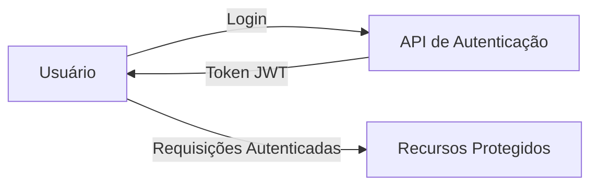
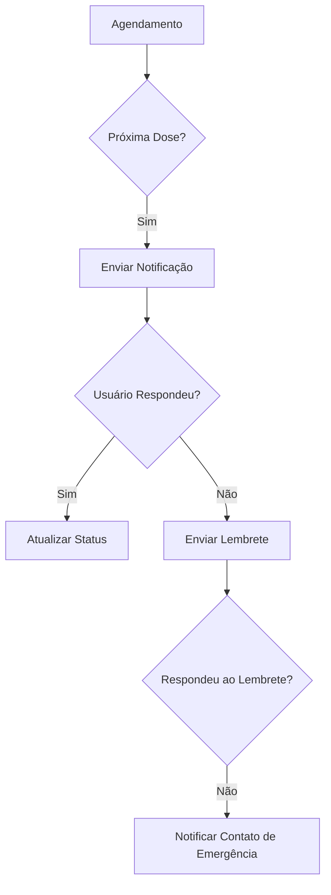

# 🚀 Apresentação: Med Alert - Sistema de Gerenciamento de Medicamentos

## 📌 Visão Geral
O **Med Alert** é um sistema completo para gerenciamento de medicamentos, projetado para ajudar usuários a manterem o controle de seus tratamentos médicos com lembretes inteligentes e acompanhamento detalhado. O aplicativo foi desenvolvido como parte do Projeto Integrador do curso de Análise e Desenvolvimento de Sistemas.

## 🎯 Objetivo Principal
Fornecer uma solução tecnológica que ajude pacientes a manterem a aderência aos seus tratamentos médicos através de lembretes personalizados e um sistema de notificações eficiente.

## 🏗️ Arquitetura do Sistema

### Frontend
- **React Native** para desenvolvimento mobile multiplataforma
- **Context API** para gerenciamento de estado global
- **React Navigation** para navegação entre telas
- **UI Kitten** para componentes de interface padronizados

### Backend
- **Node.js** com **Express** para a API REST
- **PostgreSQL** como banco de dados relacional
- **Sequelize** como ORM para interação com o banco de dados
- **JWT** para autenticação de usuários
- **Nodemailer** para envio de notificações por e-mail

### Infraestrutura
- Hospedagem em servidor Linux
- PM2 para gerenciamento de processos
- Nginx como proxy reverso
- SSL/TLS para conexões seguras

## 🔑 Funcionalidades Principais

### 1. Gestão de Medicamentos
- Cadastro de medicamentos com informações detalhadas (nome, dosagem, frequência)
- Agendamento de horários personalizados
- Histórico completo de administração
- Acompanhamento de estoque

### 2. Sistema de Notificações
- Lembretes no horário programado
- Notificações push para celular
- Alertas por e-mail para doses em atraso
- Configurações personalizáveis de alertas

### 3. Relatórios e Acompanhamento
- Relatório de adesão ao tratamento
- Histórico de medicamentos tomados/ignorados
- Gráficos de acompanhamento
- Exportação de dados em PDF

## 🔄 Fluxo de Dados

### 1. Autenticação

### 2. Fluxo de Notificações

## 📡 Principais Endpoints da API

### Autenticação
- `POST /api/auth/register` - Cadastro de novo usuário
- `POST /api/auth/login` - Autenticação de usuário
- `GET /api/auth/me` - Obter informações do usuário logado

### Medicamentos
- `GET /api/medicines` - Listar todos os medicamentos do usuário
- `POST /api/medicines` - Adicionar novo medicamento
- `PUT /api/medicines/:id` - Atualizar medicamento
- `DELETE /api/medicines/:id` - Remover medicamento
- `GET /api/medicines/upcoming` - Próximas doses

### Notificações
- `GET /api/notifications` - Listar notificações
- `POST /api/notifications` - Criar notificação
- `PUT /api/notifications/:id` - Atualizar status da notificação

## 🛠️ Tecnologias Utilizadas

### Frontend
- React Native 0.70+
- React Navigation 6.x
- UI Kitten 5.x
- Redux Toolkit
- Axios para requisições HTTP
- Moment.js para manipulação de datas

### Backend
- Node.js 18.x
- Express 4.x
- PostgreSQL 14+
- Sequelize 6.x
- JSON Web Tokens (JWT)
- Nodemailer para envio de e-mails
- Bcrypt para hash de senhas

### Ferramentas de Desenvolvimento
- Git e GitHub para controle de versão
- Postman para testes de API
- ESLint e Prettier para padronização de código
- Jest para testes automatizados

## 🔍 Diferenciais do Projeto

### 1. Sistema de Notificações Inteligente
- Lembretes em múltiplos canais (notificação push, e-mail)
- Alertas progressivos para doses em atraso
- Notificação de contatos de emergência em caso de inatividade

### 2. Interface Intuitiva
- Design limpo e acessível
- Navegação simplificada
- Feedback visual imediato para ações do usuário

### 3. Segurança
- Autenticação JWT
- Hash de senhas com bcrypt
- Proteção contra ataques comuns (XSS, CSRF)
- Validação de entrada em todas as requisições

## 📈 Próximos Passos

### Melhorias Planejadas
- Integração com farmácias próximas
- Reconhecimento de bulas de remédios via câmera
- Análise de interações medicamentosas
- Versão web para profissionais de saúde

### Expansão de Recursos
- Suporte a múltiplos idiomas
- Integração com wearables (Apple Watch, Fitbit)
- Exportação de relatórios para profissionais de saúde
- Sistema de receitas digitais

## 📚 Conclusão
O Med Alert representa uma solução tecnológica inovadora para um problema real de saúde pública: a baixa adesão a tratamentos médicos. Através de uma combinação de tecnologias modernas e uma experiência de usuário cuidadosamente projetada, o aplicativo tem o potencial de melhorar significativamente a qualidade de vida de seus usuários e os resultados de seus tratamentos médicos.

## 🙋 Perguntas?
Agora estou à disposição para responder a quaisquer dúvidas sobre o projeto, arquitetura ou implementação.
